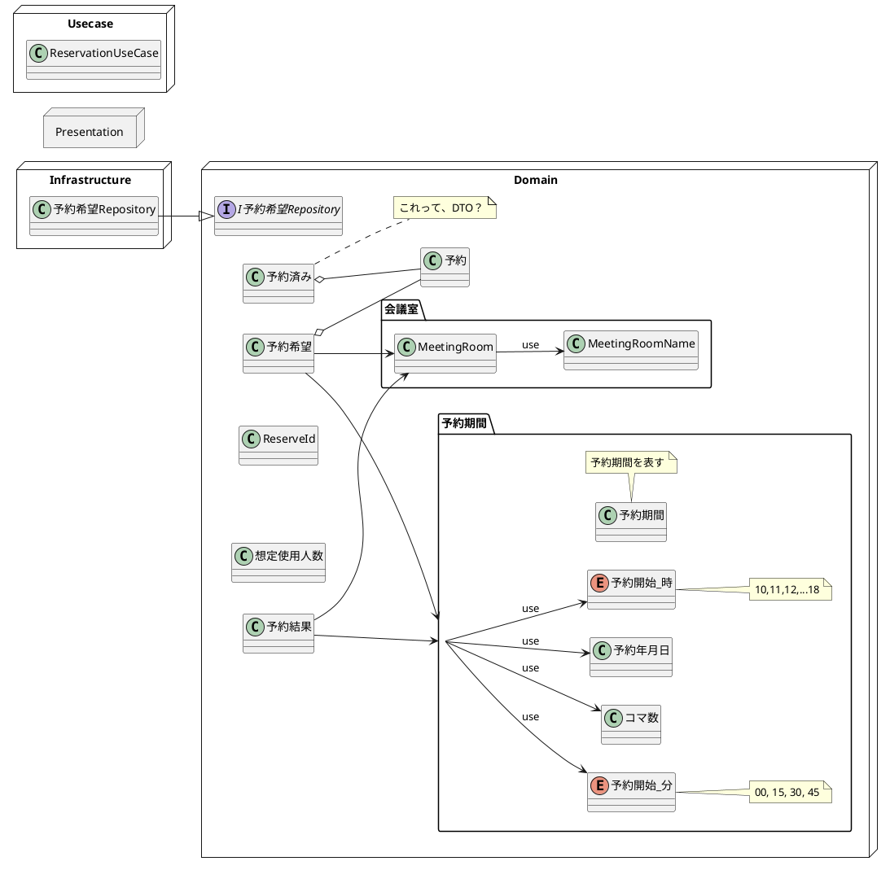

# クラスモデル図

```puml
@startuml
left to right direction

node Domain {
    interface I予約希望Repository

    Package 会議室 {
        class MeetingRoom
        class MeetingRoomName
    }

    Package 予約期間 {
        class 予約期間 
        note bottom : 予約期間を表す
        class 予約年月日
 
        enum 予約開始_時
        note right : 10,11,12,...18
 
        enum 予約開始_分
        note right : 00, 15, 30, 45

        class コマ数
    }

    予約希望 o-- 予約
    予約済み o-- 予約

    class ReserveId
    class 想定使用人数

    class 予約済み
    note right : これって、DTO？
    class 予約希望
    class 予約結果

    予約期間 --> コマ数 : use
    予約期間 --> 予約年月日 : use
    予約期間 --> 予約開始_時 : use
    予約期間 --> 予約開始_分 : use

    MeetingRoom --> MeetingRoomName : use

    予約希望 --> 予約期間
    予約希望 --> MeetingRoom

    予約結果 --> 予約期間
    予約結果 --> MeetingRoom


}


node Infrastructure {
    class 予約希望Repository
}

予約希望Repository --|> I予約希望Repository 

node Usecase {
    class ReservationUseCase
}

node Presentation {

}

@enduml
```